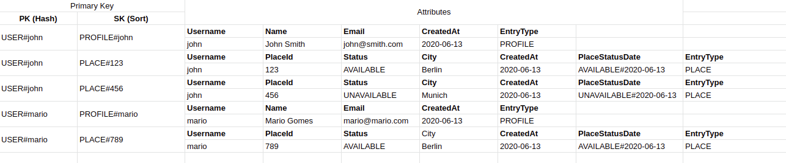
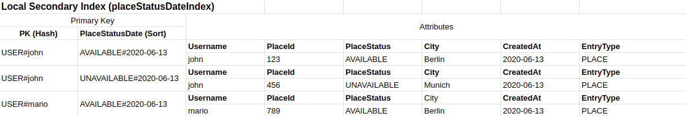

## Summary
This experiment was inspired on the talk about Data modeling with Amazon DynamoDB on AWS re:Invent 2019 (https://youtu.be/DIQVJqiSUkE). It uses a **Single Table** on DynamoDB to store User Profiles and Places owned by users.  
  
The target was to use the Query() function instead of the Scan() function as Scan() could be expensive at scale and should be avoided.
  
The target of my experiment was to retrieve all PROFILES and PLACES from **all users** on the Single Table using the **Query** function.  
  
## Schema, LSI, GSI and Access Patterns
Single Table schema contains a composed Primary Key (Partition Key + Sort Key) and attributes.
This table shares 2 types of entities - PROFILE and PLACE.
The list below shows the access patterns and the related schema, LSI and GSIs.  
  
Please consider that the condition to test the **Partition Key** MUST be always "equal to". For the **Sort Key**, it's possible to use other operators like _EQ, LE, LT, GE, GT, BEGINS_WITH() and BETWEEN()_.

#### Single Table Schema:

Example of Access Pattern:  
**_Return all Places owned by user john_**  
_"PK = USER#john AND BEGINS_WITH(SK, 'PLACE#')"_  
  
---
  
#### Local Secondary Index (placeStatusDateIndex):

Example of Access Pattern:  
**Returns all available places owned by user john**  
_"PK = USER#john AND BEGINS_WITH(PlaceStatusDate, 'AVAILABLE#')"_  
  
---  
  


## How to run
### Install dependencies:
```
$ yarn
```
or
```
$ npm install
```

### Run a local DynamoDB instance using the docker-compose file
```
$ docker-compose -f docker-compose.yaml up -d
```

### Run the script 
The script inserts fake data, run the ddb Query functions on the Single Table, and list the data to validate it works.
```
$ yarn test
```
or
```
$ npm run test
```
### 
After running the script, it should be possible to see the results on the console/terminal.
### 
You can enter http://localhost:8000/shell/ (using DynamoDB local) to check the table schema and items. Copy the script
on dynamodb-local-shell-script.js, paste into the shell and execute.
